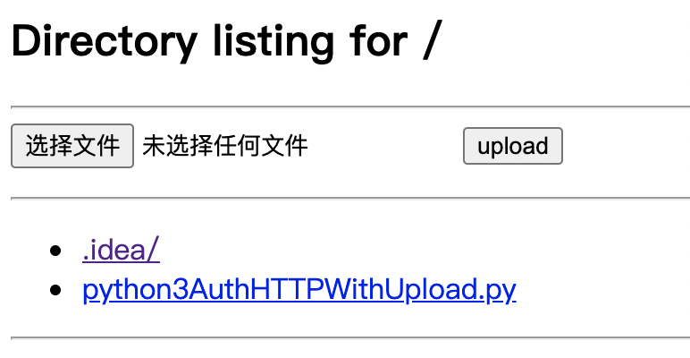

# python3AuthHTTPWithUpload
python3 http server support basic auth, file list,  file upload
It's easy to transfer file (upload and download) to server machine. 

# How to use
python3 python3AuthHTTPWithUpload.py

```
[#] Now serving HTTP on 0.0.0.0:8000 with AUTH admin:admin
[#] Ctrl+C to stop server
```

# ScreenShot
</img>

